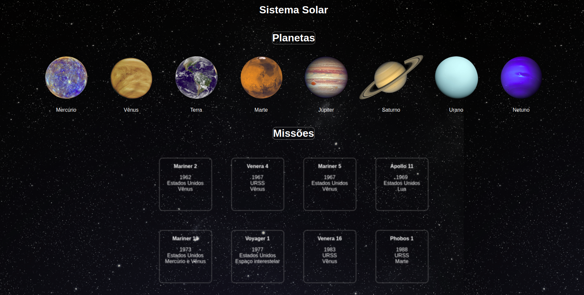

<h1>🌎 Solar System </h1>

<h1>

</h1>

<h3 align="center">
  <a href="https://thierrydrmv.github.io/Solar-System/" target="_blank">Acessar o projeto</a>
</h3>

## 📝 Sobre

O projeto **SolarSystem** é uma página web construída em react. Foi criada durante o módulo de front-end da **Trybe** com o objetivo de colocar em prática: Criar e manipular componentes em React;
Fazer o uso de Props para passar valores aos componentes;
Utilizar o PropTypes para checagem de tipos;

---

## 🔗 Links

Linkedin: https://www.linkedin.com/in/varela-thierry/

Github: https://github.com/thierrydrmv

Site: https://thierrydrmv.github.io/Solar-System/

---
